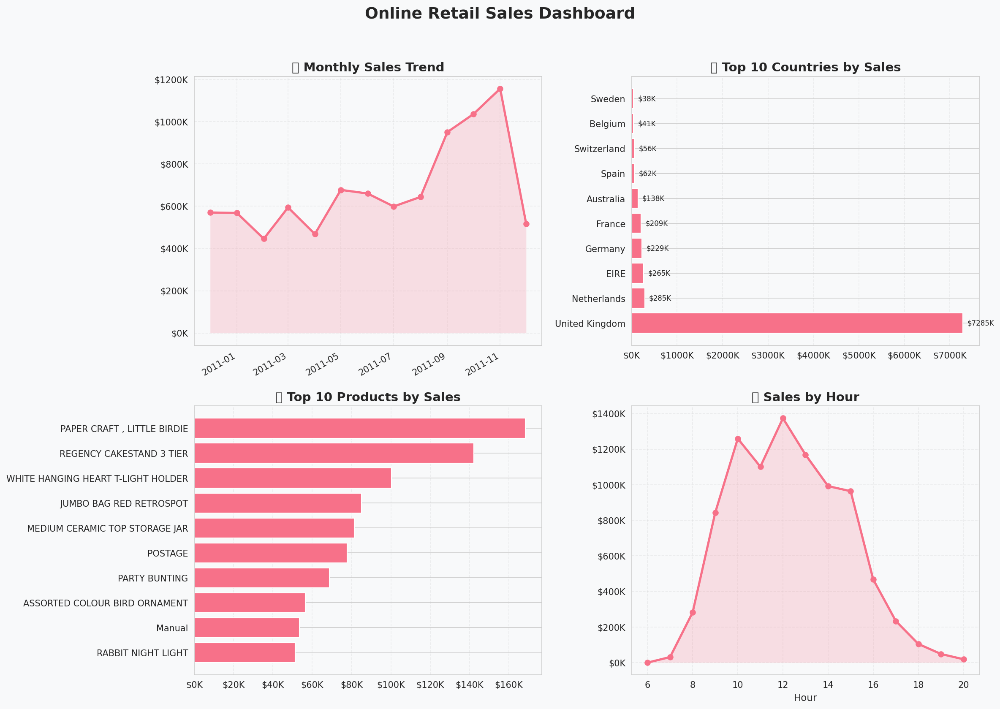

# 🛒 Online Retail Sales Analysis

## 📌 Project Overview

This project focuses on analyzing an Online Retail Dataset using Python for data cleaning, exploratory data analysis (EDA), visualization, and business insight generation.

The objective of this project is to transform raw transactional retail data into meaningful insights that can support business decision-making.

---

# 🎯 Objectives

* Clean and preprocess retail transaction data
* Perform exploratory data analysis (EDA)
* Analyze customer purchasing behavior
* Identify top-performing products and countries
* Create sales dashboard visualizations
* Generate actionable business insights

---

# 📂 Dataset

Dataset used:

* **Online Retail Dataset**

Dataset columns:

* InvoiceNo
* StockCode
* Description
* Quantity
* InvoiceDate
* UnitPrice
* CustomerID
* Country

---

# 🛠️ Tools & Libraries

### Programming Language

* Python

### Libraries

* Pandas
* NumPy
* Matplotlib
* Seaborn

### Environment

* Jupyter Notebook
* Google Colab

---

# 🧹 Data Cleaning Process

The following preprocessing steps were applied:

✅ Removed missing CustomerID
✅ Removed duplicate rows
✅ Removed negative Quantity values
✅ Removed invalid UnitPrice values
✅ Converted InvoiceDate to datetime format
✅ Created new features for analysis

---

# ⚙️ Feature Engineering

Additional features created:

* TotalPrice
* Year
* Month
* Quarter
* Hour
* Day_Name

Example:

```python
df['TotalPrice'] = df['Quantity'] * df['UnitPrice']
```

---

# 📊 Exploratory Data Analysis (EDA)

Analysis performed:

* KPI Summary
* Monthly Sales Trend
* Country Analysis
* Customer Lifetime Value (CLV)
* Top Products Analysis
* Hourly Sales Analysis
* Heatmap Visualization

---

# 📈 Dashboard Visualization

The project includes visual dashboards such as:

* Monthly Sales Trend
* Top Countries by Revenue
* Top Selling Products
* Sales by Hour
* Heatmap Analysis

---

# 🔍 Key Insights

### 💡 Insight 1 — Top Market

United Kingdom generated the highest revenue among all countries.

### 💡 Insight 2 — Peak Transaction Hour

Certain hours showed significantly higher transaction activity.

### 💡 Insight 3 — Best Selling Products

Several products contributed disproportionately to overall revenue.

### 💡 Insight 4 — Seasonal Trend

Sales showed seasonal patterns during specific months.

---

# 💼 Business Recommendations

* Focus marketing strategies on top-performing countries
* Increase stock for best-selling products
* Optimize promotions during peak transaction hours
* Prepare inventory before high-season periods
* Apply customer segmentation strategies

---

# 📁 Project Structure

```bash
📦 Online-Retail-Analysis
 ┣ 📜 Online Retail.xlsx
 ┣ 📜 Online_Retail_Cleaned.xlsx
 ┣ 📜 analysis.ipynb
 ┣ 📜 dashboard_charts.png
 ┣ 📜 heatmap_sales.png
 ┣ 📜 README.md
```

---

# 🚀 Skills Demonstrated

* Data Cleaning
* Data Wrangling
* Exploratory Data Analysis
* Data Visualization
* Business Analytics
* Python Programming
* Storytelling with Data

---

# 📷 Sample Visualizations

(Add your dashboard screenshots here)

Example:

```markdown

```

---

# 🔗 Future Improvements

Potential future development:

* Sales Forecasting
* Customer Segmentation
* Recommendation System
* Interactive Dashboard (Power BI/Tableau)
* Machine Learning Models

---

# 👤 Author

Name: Nayaka

LinkedIn: [[Nayaka Khansa Alana](https://www.linkedin.com/in/nayaka-khansa-alana)]
GitHub: [[nayakakhansaalana](https://github.com/nayakakhansaalana)]

---

# ⭐ If you like this project

Feel free to give this repository a star ⭐
